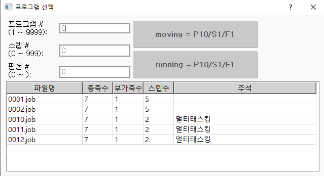

# 2.4.2 수동 소멸

서브태스크를 수동으로 소멸시키고 클리어하는 것은 모니터링 창에서 프로그램 번호를 0으로 선택하는 방식으로 할 수 있습니다. 절차는 다음과 같습니다.

『**창선택**』 → 『**멀티태스크**』에서 원하는 서브태스크로 커서를 이동하여 『**편집**』 버튼으로 프로그램 번호를 ‘**0**’선택

이외에도 수동모드에서 메인태스크의 프로그램을 다시 선택하면 모든 서브태스크가 소멸됩니다.

