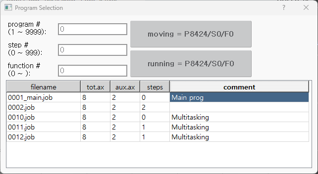

# 2.4.2 Manual destruction

You can manually destroy and clear a subtask by selecting the program number `0` in the monitoring window. Procedure:

From **Window Select** → **Multitasking**, move the cursor to the desired subtask and choose **Edit**, then set the program number to `0`.

Additionally, executing `task reset` will destroy the associated subtask.

The following operations will destroy all sub tasks:
- Re-selecting the main taskprogram in MANUAL mode
- Executing `*R0 : Task Reset*` in MANUAL mode
